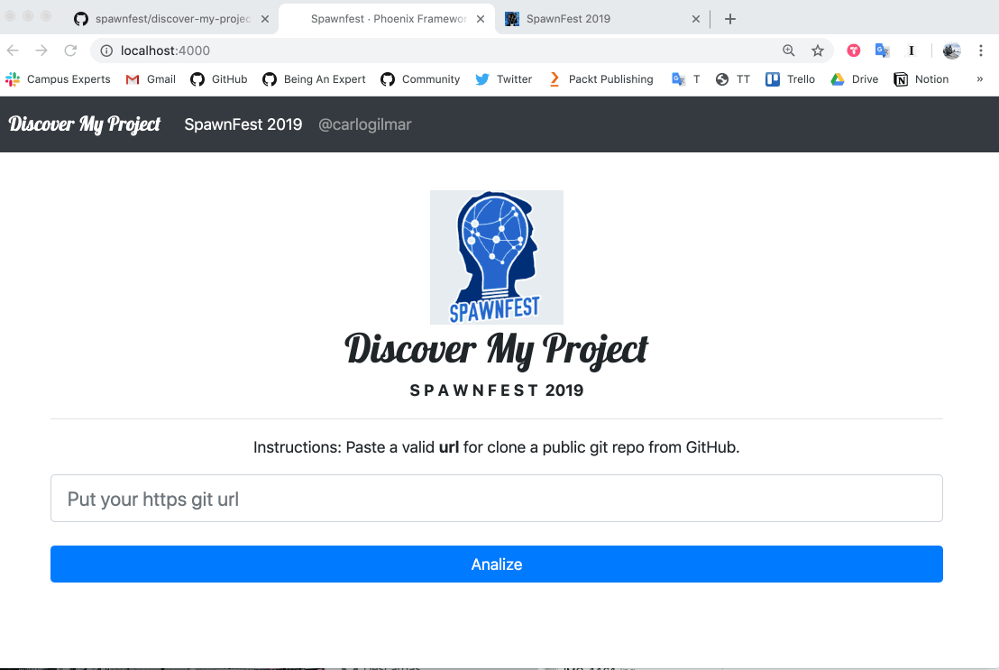
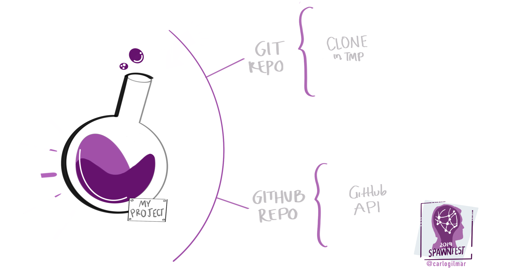
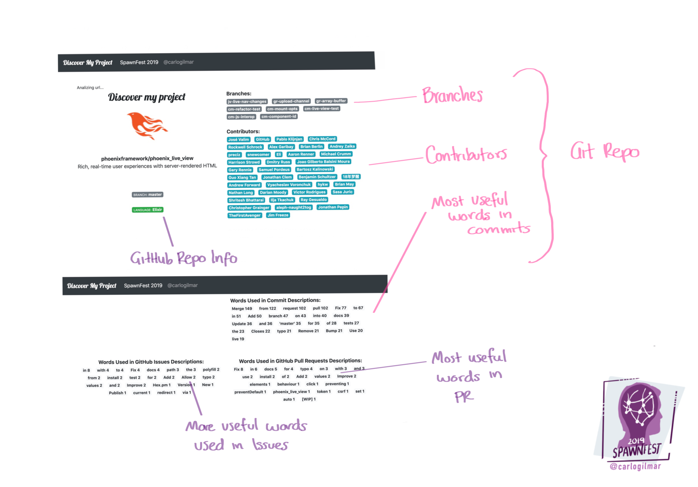
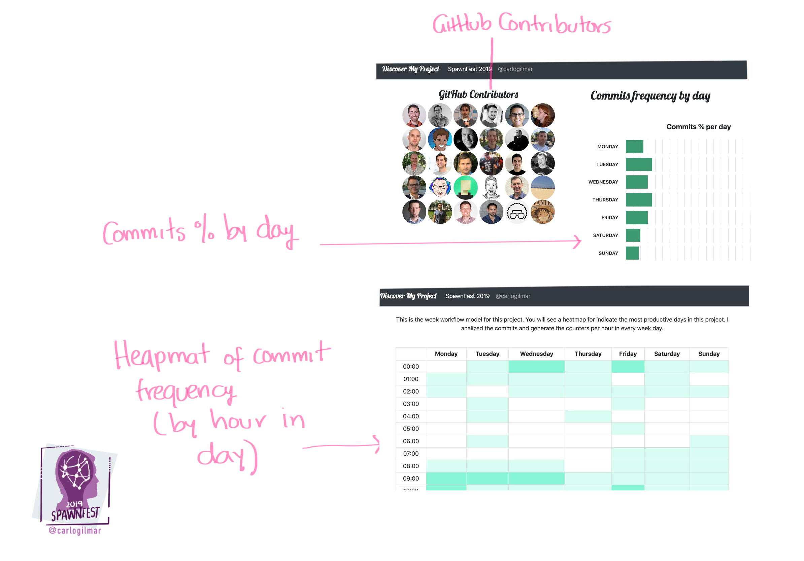

### Spawnfest
# Discover My Project

*Author: @carlogilmar*

**Project made for Spawnfest 2019 🇲🇽**

# DEMO

**"Discover my project"** is about to get information from a *Repo URL*. The idea behind this is analize an Open Source project for know more about his development history and understand how this project was built. For this I tried to analize two information sources: the git data, and the github api. I want to build a platform for generate open source development process based on their version control history for learn more about how this developers are writting software.

## Setup

  * Install dependencies with `mix deps.get`
  * Install Node.js dependencies with `cd assets && npm install`
  * Start Phoenix endpoint with `mix phx.server`

#### Dependencies

## Development

I implemented a git hook for add some valuable tools, so please for development then to clone this repo, run the *install_credo_hooks.sh* script. This script will install a *pre-push* git hook in this repo.

The main goal for this hook is run credo before to make a push to the remote repository, if there are some credo suggestions, the push will be stopped, if you don't have suggestions the push will be uploaded.

Example

I made this for ensure quality in the code analysis made by *Credo*

## Discover My Project

The main goal is explore an open source project through the git data and the github information. It's inspired in [Git Stats Ruby Gem](https://github.com/tomgi/git_stats).

## Technical Design

The main flow is represented by the  follow illustration:

The main flow was wrote in `core.ex`:

## How the project works

Then to run the phoenix server, open `http://localhost:4000/`.

I choosed the Phoenix Live Views as the repo for test  the main flow, you  can try it too!

> https://github.com/phoenixframework/phoenix_live_view.git

Then you will have the analysis:

Features:

- GitHub Repo Information (org image, repo full name, description, default branch, and language)
- Branches in repo
- Contributors in repo
- More useful words in commits
- More useful words in issues GitHub
- More useful words in PR GitHub

- GitHub Contributors
- Commits frequency by day %
- Heapmat frequency by hour in day

## Features

- Cloning a repo from a https git url
- Get all commits as structs
- Get more useful words from commits structs
- Get the list of branches in the cloned repo
- Generate the commits frequency by day
- Generate the % by commits made in day
- Get info from the GitHub API
- Get Issues, PR, contributors and repo info from GitHub API
- Get more useful words from issues
- Get more useful words from PR

## TO DO

- Get commits frequency by author
- Get commits frequency by branch
- Get commits frequency by month
- Generate the workflow chart for show the repo construction
- Analize the words used in commits vs words used in PR vs words used in issues
- Add railway pattern for validate errors when the api don't response
- Add more validations for get a valid url
- Accept more platforms: GitLab, etc...

