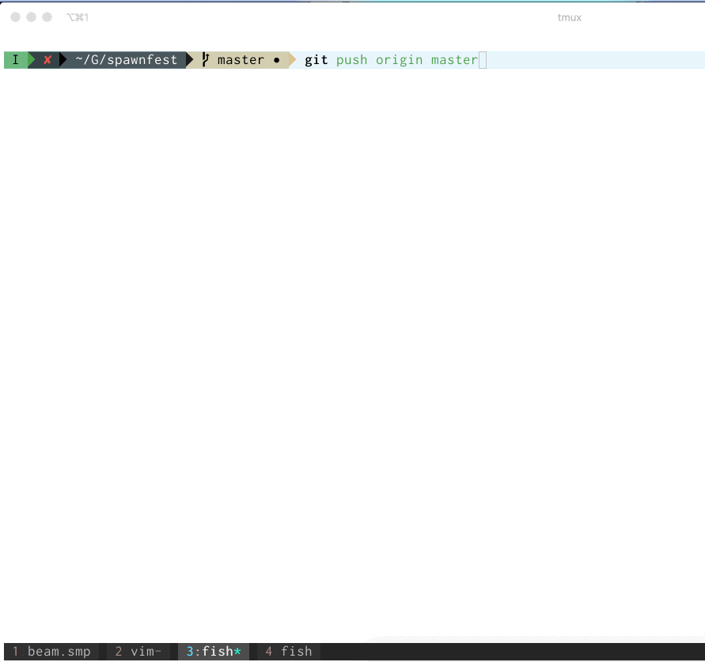

### Spawnfest
# Discover My Project

*Author: @carlogilmar*

**Project made for Spawnfest 2019 🇲🇽**

## Setup

  * Install dependencies with `mix deps.get`
  * Install Node.js dependencies with `cd assets && npm install`
  * Start Phoenix endpoint with `mix phx.server`

## Development

I implemented a git hook for add some valuable tools, so please for development then to clone this repo, run the *install_credo_hooks.sh* script. This script will install a *pre-push* git hook in this repo.

#### How it works?
The main goal for this hook is run credo before to make a push to the remote repository, if there are some credo suggestions, the push will be stopped, if you don't have suggestions the push will be uploaded.

Example

I made this for ensure quality in the code analysis made by *Credo*
